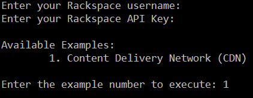

This is a sample solution containing the code from the [.NET Quickstart for Rackspace](https://developer.rackspace.com/sdks/dot-net/).

Each API will have a folder containing two files:

* **Example.cs** is the exact code from the examples in the documentation.
* **Test.cs** is runnable test code containing the same logic from the example.

To run the application:

1. Load the solution in Visual Studio.
2. Run the solution (F5).
3. When prompted enter your Rackspace Cloud username and apikey.
4. Select an example to execute.

